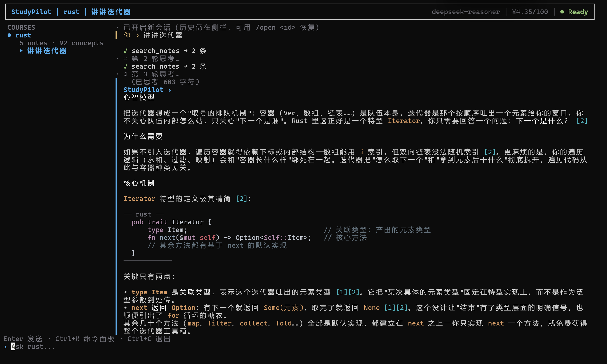
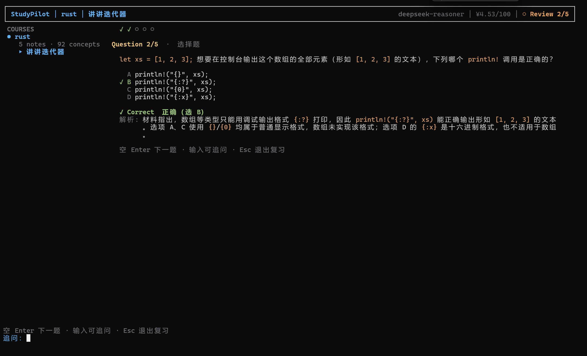
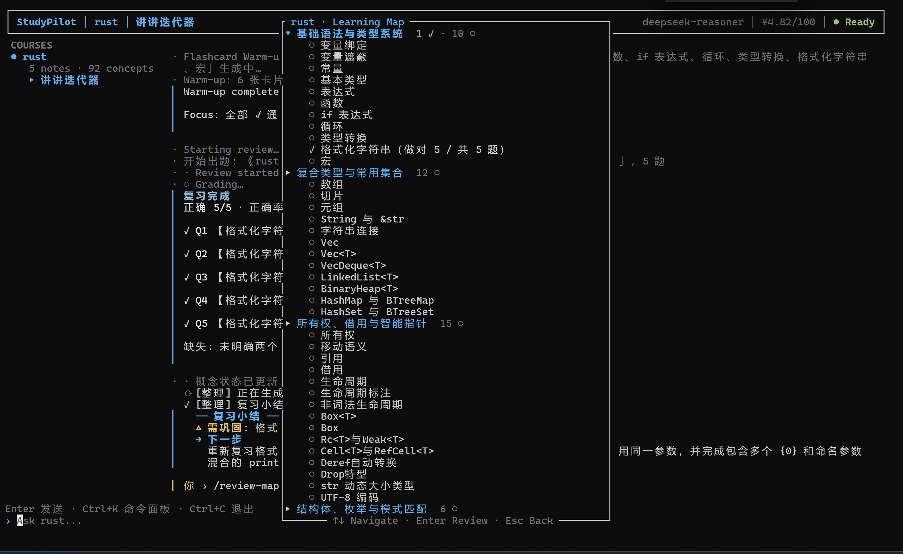

# StudyPilot

StudyPilot 是一个运行在终端里的 AI 学习 Agent。它把课程笔记组织成可问答、可出题、可追踪的个人知识库：导入资料后，可以基于你的笔记提问、自动生成复习题，并记录你对每个知识点的掌握情况。所有数据保存在本地，支持接入多家 AI 服务商。

---

## 界面预览







---

## 为什么是 StudyPilot？

通用对话助手的局限在于：回答不基于你的资料、不会主动检测你掌握与否、更不会针对薄弱点安排复习。StudyPilot 围绕「学习」这个场景做了专门设计：

- **回答有依据**——基于你的笔记回答并标注来源，笔记未覆盖的部分会明确说明
- **结构可追踪**——导入时自动抽取知识点、组织成章节结构，并记录每个知识点的掌握状态
- **复习成闭环**——先闪卡 recall、再正式出题、即时批改，薄弱知识点自动优先重考

这些能力在 Features 中逐项展开。

---

## Features

### Material-grounded Q&A

基于你导入的笔记回答，而非通用知识库。回答中的关键事实标注来源编号（如 `[1]`），对应具体笔记片段；笔记没有覆盖的内容会标明「（笔记外补充）」，避免把模型知识伪装成笔记内容。

### Learning Map

导入的资料会自动抽取为知识点，并按主题组织成「章节 → 概念」的结构。每个知识点标记掌握状态：已掌握（✓）、需巩固（△）、未复习（○），让"学了什么、哪里薄弱"一目了然。

### Review（复习闭环）

复习分为两个阶段：

1. **Flashcard Warm-up**：先出几张 recall 卡片快速自检，你自评后，薄弱概念会进入正式复习的重点范围
2. **Formal Review**：逐题生成选择题 / 简答题；选择题即时判分，简答题由模型批改打分并指出缺失要点

每次作答计入学习历史，答错的概念在后续复习中优先出现。

### Model Roles（模型分级）

同一门课的不同任务可以分配不同的模型：导入、出题等高频任务用便宜快速的模型；批改、复杂推理用更强但更贵的模型。这样在保证质量的同时控制成本。

---

## Supported Providers & Models

以下为当前内置的服务商及常用模型（均可通过命令行面板选择，也可以在配置文件中指定）：

| Provider | Models |
|---|---|
| DeepSeek | `deepseek-chat` · `deepseek-reasoner` |
| Qwen (通义千问) | `qwen3-max` · `qwen3-plus` · `qwen3-turbo` · `qwen-max` · `qwen-long` |
| GLM (智谱) | `glm-4-plus` · `glm-4-air` · `glm-4-flash` · `glm-4-long` |
| Kimi (Moonshot) | `kimi-latest` · `kimi-k2` · `moonshot-v1-128k` · `moonshot-v1-32k` · `moonshot-v1-8k` |
| MiniMax | `MiniMax-Text-01` · `MiniMax-M1` · `abab6.5s-chat` |
| Doubao (火山方舟) | `doubao-seed-1-6-flash` · `doubao-1.5-pro-32k` · `doubao-1.5-pro-256k` · `doubao-1.5-lite-32k` |
| Hunyuan (腾讯混元) | `hunyuan-turbos` · `hunyuan-pro` · `hunyuan-standard` · `hunyuan-lite` |
| ERNIE (百度千帆) | `ernie-4.0-8k` · `ernie-3.5-8k` · `ernie-speed-8k` · `ernie-lite-8k` |
| OpenAI | `gpt-4o` · `gpt-4o-mini` · `gpt-4.1` · `gpt-4.1-mini` · `o3` · `o4-mini` |
| Anthropic (Claude) | `claude-sonnet-4` · `claude-opus-4` · `claude-haiku-4` · `claude-3-7-sonnet` |
| Gemini (Google) | `gemini-2.5-pro` · `gemini-2.5-flash` · `gemini-2.5-flash-lite` · `gemini-2.0-flash` |
| Grok (xAI) | `grok-3` · `grok-3-mini` · `grok-2` |
| OpenRouter | `anthropic/claude-3.7-sonnet` · `openai/gpt-4o` · `deepseek/deepseek-chat` · `google/gemini-2.5-flash` |
| Ollama (本地) | `llama3.2` · `qwen3:8b` · `deepseek-r1:7b` · `phi4` |

此外支持任意 **Custom OpenAI-compatible** 服务（自定义 Base URL 与模型名）。

---

## Installation

### 使用 Release 版本

到本项目的 Releases 页面下载对应平台的压缩包，解压即可运行，无需安装 Rust 或 Python：

- **Windows**：`StudyPilot-windows-x64.zip`，解压后运行 `studypilot.exe`
- **Linux**：`StudyPilot-linux-x64.tar.gz`，解压后运行 `./studypilot`

### 从源码构建

```bash
git clone <repo-url>
cd <repo-dir>
cargo build --release
```

依赖：

- **Rust**（stable 工具链）
- **Python 3 + PyMuPDF**（用于提取 PDF 内容）

```bash
pip install pymupdf
# Debian/Ubuntu (PEP 668) 环境：pip install --break-system-packages pymupdf
```

---

## Quick Start

1. **配置 AI**：首次启动自动进入 AI Setup。选择 Provider → 选择 Model → 填入 API Key → 点 Test 测试连接，通过后进入主界面。之后随时可用 `Ctrl+K → Model` 重新配置。

2. **导入资料**：`Ctrl+K` → Import → 选择你的资料文件夹（支持 Markdown / PDF / PPTX）。导入时每个文件会显示处理进度；完成后在聊天区看到每个文件抽取出的概念数。

3. **提问**：直接在底部输入问题，例如"什么是所有权？"。回答会基于你的笔记展开，关键事实后带 `[1]` 等编号——它们在回答下方对应具体笔记片段；笔记没覆盖的内容会标「（笔记外补充）」。

4. **复习**：`Ctrl+K` → Review。先出现几张闪卡：`Space` 翻开答案、`1/2/3` 自评（会了 / 一般 / 不会）、`Enter` 下一张。闪卡结束后进入正式复习——选择题用 `↑↓` 或 `A-D` 作答、`Enter` 提交；简答题在底部输入答案、`Enter` 提交批改，会看到得分和缺失要点。

5. **查看进度**：`Ctrl+K` → Review Map。每个知识点标有状态：✓ 已掌握 / △ 需巩固 / ○ 未复习。用 `↑↓` 浏览，选中某个概念或章节可直接复习。

---

## Usage

所有功能都可以通过 **Command Palette** 完成——按 `Ctrl+K` 打开，按分组浏览，无需记忆命令：

- **会话**：New Conversation · Recent Sessions · Rename Session · Export / Load Conversation
- **学习**：Import Materials · Review · Review Map · Outline
- **课程**：Switch Course · New Course · Rename / Delete Course
- **设置**：Model（切换模型 / 配置角色）· Budget（费用上限）

几个常用操作：

- **切换课程**：`Ctrl+K` → Switch Course，选择目标课程后，之后的提问和复习都在该课程内进行
- **跨课程提问**：切换到 `Global`（全部课程），可检索所有课程的笔记
- **费用控制**：`Ctrl+K` → Budget 查看累计花费、设置上限；达到上限后自动停止调用，避免超出预算
- **导出会话**：`Ctrl+K` → Export Conversation 保存为文件，之后可用 Load Conversation 恢复

---

## Configuration

配置文件存放在 `~/.studypilot/`（首次启动自动创建）：

| 文件 | 内容 |
|---|---|
| `config.toml` | Provider / Model 列表、默认模型、Model Roles、预算上限 |
| `auth.toml` | API Key（权限 0600，与配置分离，不会写回 config.toml） |

配置项包括：

- **API Key**：在 AI Setup 中填写，或写入 `auth.toml`；也支持通过环境变量引用（`api_key_env`）
- **Endpoint**：每个 Provider 预设了默认端点；Custom Provider 可自定义 Base URL
- **Model**：可通过命令面板切换并持久化为默认模型
- **Custom OpenAI-compatible Provider**：在 Setup 中选择 Custom，填写 Provider 名称、Base URL、Model、API Key
- **Model Roles**：在 `config.toml` 的 `[roles]` 中为 fast / balanced / reasoning 三种任务角色指定模型（如 `fast = "deepseek/deepseek-chat"`）
- **Budget**：在命令面板设置每日/累计费用上限，超出后停止调用

---

## Architecture

```
                 ┌─────────────┐
                 │     User    │
                 └──────┬──────┘
                        ↓
                 ┌─────────────┐
                 │  StudyPilot │
                 │     TUI     │
                 └──────┬──────┘
                        ↓
          ┌─────────────┴─────────────┐
          ↓                           ↓
    Learning Agent               Review Engine
          ↓                           ↓
        RAG                      Learning Map
          ↓                           ↓
     Materials                Concept / Mastery
```

StudyPilot 由两部分协作：**Learning Agent** 负责基于资料的问答（检索笔记 → 生成带引用的回答），**Review Engine** 负责复习闭环（组织复习地图 → 出题 → 批改 → 更新掌握度）。两者都建立在本地 SQLite 数据库之上（存储笔记、会话与学习历史）。

---

## License

MIT
